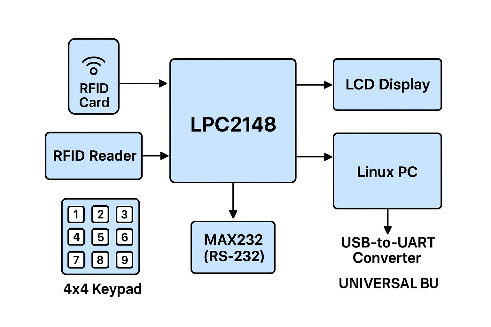

# 📡 Database-Driven Billing System (RFID + LPC2148)

## 📖 Overview

This project implements a **real-time, embedded billing system** using **RFID technology** and the **LPC2148 ARM7 microcontroller**.
The system communicates with a **Linux database via UART**, supports **cash & card payments**, and performs **stock management with billing automation**.

---

## 🎯 Key Features

* 🔐 RFID-based **item recognition & manager access**
* 🔄 **UART-driven MCU ↔ Linux communication**
* 📊 Real-time **stock updates & billing**
* 💳 **Dual Payment Modes**: Cash / Card (PIN validation)
* 🚫 Handles **invalid cards & low stock**
* 🔧 Expandable for **new products/banks**

---

## 🔧 Requirements

### Hardware

* LPC2148 ARM7 Microcontroller
* RFID Reader + RFID Cards
* 16x2 LCD Display
* 4x4 Keypad + Switches
* MAX232 (RS-232 level conversion)
* USB-to-UART Converter

### Software

* **Embedded C** (Keil uVision for coding & compilation)
* **Flash Magic** (upload firmware to LPC2148)
* **Linux (gcc)** for UART + database
* **UART Loopback test program**

---

## 📂 Project Structure

```
DATABASE-DRIVEN-BILLING-SYSTEM/
│
├── Embedded_Code/
│   ├── lcd.c, lcd.h
│   ├── uart.c, uart.h
│   ├── keypad.c, keypad.h
│   ├── eint0_eint1.c, header.h
│   ├── delay.c, delay.h
│   └── projectmain.c
│
├── Linux_Code/
│   ├── uart_linux.c
│   ├── main.c, myheader.h
│   ├── stock.txt
│   └── bank.txt
│
└── README.md
```

---

## 🖼 Block Diagram


*(Shows LPC2148 connected to RFID reader, LCD, keypad, MAX232, and Linux PC via UART)*

---

## 🔄 System Flow


*(Illustrates RFID scan → Validation → Stock update → Billing → Payment → Database update)*

---

## 🚀 Running the Project

### 1️⃣ Microcontroller Setup

* Write and test drivers:

  * LCD, UART0/UART1, RFID, Keypad, External Interrupts
* Integrate into `projectmain.c`
* Compile in **Keil uVision**, generate HEX
* Flash LPC2148 using **Flash Magic**

### 2️⃣ Linux Setup

* Compile `uart_linux.c` →

  ```bash
  gcc uart_linux.c -o uart_app
  ./uart_app
  ```
* Prepare data files:

  * `stock.txt` → inventory (item, qty, price)
  * `bank.txt` → bank account details (acc no, balance, PIN)
* Run listener to sync data with MCU

---

## 📑 Data Formats

* **Manager Card** → `$<CARDNUMBER>&`
* **Customer Card** → `$&`
* **Delete Card** → \`\$&\`\`

### Example `stock.txt`

| Item  | CardNumber | Qty | Price |
| ----- | ---------- | --- | ----- |
| SOAPS | 00332069   | 190 | 100   |
| MILKY | 00336463   | 95  | 50    |
| CHIPS | 00312472   | 26  | 10    |

### Example `bank.txt`

| Bank Name | Acc Number | Balance | PIN  |
| --------- | ---------- | ------- | ---- |
| VECTOR    | 12638754   | 10000   | 1234 |

---

## ⚙️ Workflow

1. LCD shows **"RFID SYSTEM READY"**
2. User selects **Entry / Delete / Exit**
3. On RFID scan:

   * 🛠 Manager Card → **Stock Update**
   * 🛒 Item Card → **Purchase & Billing**
4. On Exit:

   * Select **Cash / Card Payment**
   * Validate PIN (ATM emulation)
   * Update stock & bank balance

---

## 📎 Notes

* **UART0** → Linux communication
* **UART1** → RFID input
* Add-on improvements possible:

  * Multi-user database
  * Extended categories
  * Secure PIN hashing

---

## ✅ Status

* ✅ RFID Reader integration
* ✅ UART communication (LPC2148 ↔ Linux)
* ✅ Real-time billing & stock update
* ✅ Cash/Card payment simulation
* ✅ Embedded + Linux code included


